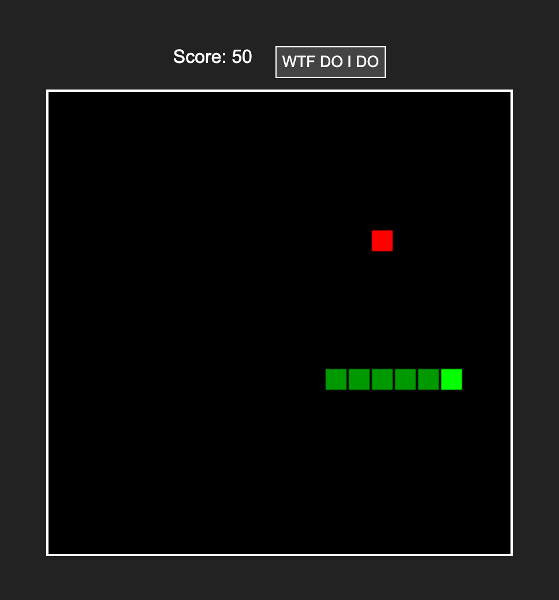

# snake-in-2.7kb
A pretty good snake game with instructions, scores and more. It has CSS and looks pretty cool.

To use this on your own website use this library:
`https://rawcdn.githack.com/dropalltables/snake-in-2.7kb/refs/heads/main/lib.min.js`
Add a `<snake-game></snake-game>` element and snake will show up.
